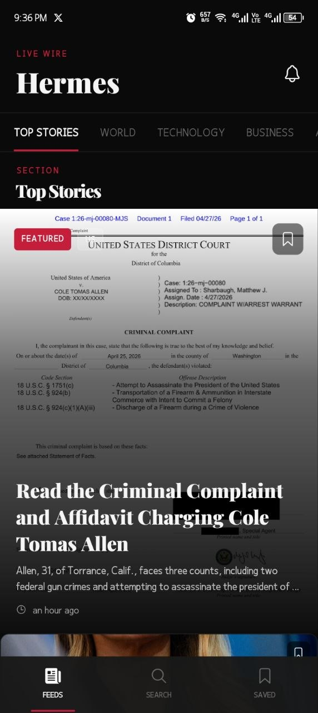
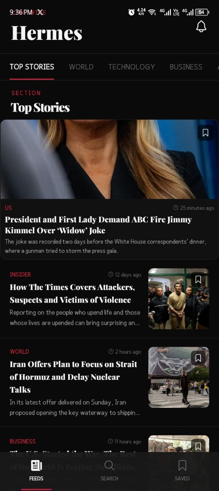
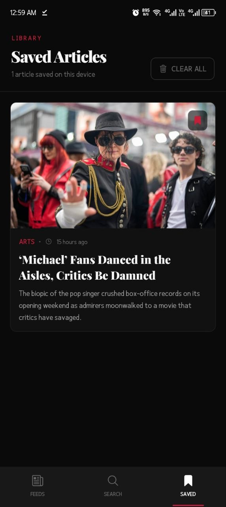
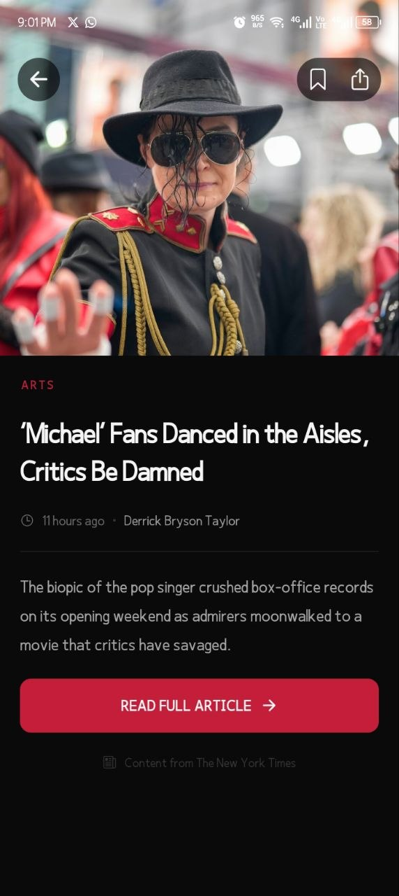

# Hermes — Premium News App

> A beautifully crafted editorial news experience built with React Native, Expo and TamagUI, powered by The New York Times API.

---

## Overview

**Hermes** is a premium mobile news application that delivers real-time news from The New York Times with a focus on editorial design, smooth animations, and a seamless user experience.

The app is named after the Greek messenger god which I felt was a fitting metaphor for a news delivery platform. The visual identity draws inspiration from the NYT masthead: high-contrast serif typography, a strict black and red palette, and clean editorial layouts.

---

## Screenshots

<div align="center">
  
  
  
  
  
  
</div>

## App Features

### Feed Screen
- Full-screen hero card for the featured article with image, section badge, headline, abstract, and byline
- Horizontal scrollable category tabs with animated red underline indicator
- Mixed layout feed — horizontal cards and 2-column grid cards for visual rhythm
- Sticky header with the Hermes wordmark and category navigation
- Pull-to-refresh to fetch the latest articles
- Section-based browsing across Top Stories, World, Technology, Business, Arts, Sports, Science, Health, Travel, Fashion, and Food

### Search Screen
- Animated search input with red border glow on focus
- Real-time debounced search (500ms) — fires after 3+ characters
- Results count display
- Section-colored fallback placeholders for articles without images
- Empty state for no query and no results scenarios

### Saved Articles Screen
- Bookmark any article from the feed, search, or detail screens
- Persistent bookmarks stored across the session
- Article count with singular/plural handling
- Clear all bookmarks with one tap
- Empty state when no articles are saved

### Article Detail Screen
- Full-bleed hero image with parallax scroll effect
- Floating back, bookmark, and share buttons
- Sticky header that fades in as you scroll past the hero
- Title in Playfair Display serif typography
- Byline, relative timestamp, and abstract
- In-app WebView for reading the full article on NYT

### Offline & Error Handling
- TanStack Query caches all fetched articles in memory for the session
- Stale data served instantly on re-navigation (5 minute stale time)
- User-friendly error states with retry buttons for network failures, API errors, and rate limits
- Empty states for zero results

---

## APIs Used

| API | Usage | Link |
|-----|-------|------|
| NYT Top Stories API | Home feed and category browsing | [developer.nytimes.com](https://developer.nytimes.com/docs/top-stories-product/1/overview) |
| NYT Article Search API | Keyword search with debouncing | [developer.nytimes.com](https://developer.nytimes.com/docs/articlesearch-product/1/overview) |

Both APIs are free with an API key from the NYT Developer Portal. The Top Stories API supports section-based filtering across 11 categories. The Article Search API supports full-text keyword search sorted by newest.

---

## Animation Highlights

### 1. Staggered List Entrance
Every article card animates in with a fade + slide-up entrance. Cards are staggered by `index * 80ms` so they cascade in one after another as the feed renders. Implemented with Reanimated 4's `withDelay`, `withTiming`, and `withSpring`.

### 2. Category Tab Indicator
The active tab underline slides and scales between tabs using `Animated.spring` with `scaleX` transform. Animating `transform` instead of `width` keeps the animation on the GPU thread — smooth at 60fps regardless of JS thread load.

### 3. Search Input Border
The search input border interpolates from `#2e2e2e` to `#C41E3A` on focus using Reanimated's `interpolateColor` and `useDerivedValue`. Runs entirely on the UI thread.

### 4. Tab Bar Icons
Each tab icon scales up with a spring animation on focus and fades opacity. A small red line beneath the active icon label which scales in using `withSpring`. All running on the UI thread via Reanimated shared values.

### 5. Article Detail Parallax
The hero image on the article detail screen moves at half the scroll speed using `useScrollOffset` and `interpolate` — creating a depth effect as content scrolls over the image.

### 6. Sticky Header Fade
The article detail header is invisible at the top and fades in as you scroll past the hero using `interpolate` on the scroll offset. The floating action buttons fade out simultaneously to avoid duplication.

### 7. Skeleton Shimmer
While articles are loading, shimmer skeleton cards animate between two dark tones using `withRepeat` and `interpolateColor` — matching the exact dimensions of the real cards.

---

## Architecture

```
src/
├── app/                          # Expo Router file-based routing
│   ├── _layout.tsx               # Root layout with all providers
│   ├── (tabs)/
│   │   ├── _layout.tsx           # Tab navigator with animated tab bar
│   │   ├── index.tsx             # Feed screen
│   │   ├── search.tsx            # Search screen
│   │   └── bookmarks.tsx         # Saved articles screen
│   └── article/
│       └── [id].tsx              # Article detail screen
├── constants/
│   ├── categories.ts             # NYT sections, icons, section colors
│   └── theme.ts                  # Font constants, animation config
├── features/
│   ├── article/
│   │   └── components/
│   │       ├── ArticleBody.tsx
│   │       ├── ArticleHero.tsx
│   │       └── ArticleWebView.tsx
│   ├── bookmarks/
│   │   ├── components/
│   │   │   ├── BookmarkButton.tsx
│   │   │   └── BookmarksList.tsx
│   │   └── store.ts              # Zustand bookmarks store
│   ├── feed/
│   │   ├── components/
│   │   │   ├── ArticleCard.tsx   # Default, grid and large variants
│   │   │   ├── CategoryTabs.tsx  # Animated tab indicator
│   │   │   └── HeroCard.tsx      # Featured hero card
│   │   └── hooks/
│   │       ├── useFeed.ts        # TanStack Query — top stories
│   │       └── useTopStories.ts  # Fetcher + normalizer
│   └── search/
│       ├── components/
│       │   ├── SearchBar.tsx
│       │   └── SearchResults.tsx
│       └── hooks/
│           └── useSearch.ts      # Debounced search query
└── shared/
    ├── components/
    │   ├── EmptyState.tsx
    │   ├── ErrorState.tsx
    │   ├── Icon.tsx
    │   ├── SkeletonCard.tsx      # Shimmer skeleton for feed
    │   └── SkeletonHero.tsx      # Shimmer skeleton for hero
    ├── hooks/
    │   └── useNetworkStatus.ts
    ├── lib/
    │   ├── api.ts                # Axios instance + NYT interceptors
    │   ├── queryClient.ts        # TanStack QueryClient config
    │   └── storage.ts            # Storage adapter
    └── types/
        ├── api.ts                # Raw NYT API response types
        └── article.ts            # Normalized Article type
```

**Pattern:** Raw NYT API responses are normalized into a single internal `Article` type in the data layer before reaching any component. This decouples the UI completely from the API shape.

---

## Libraries & Dependencies

| Package | Purpose |
|---------|---------|
| `expo` (SDK 54) | Core Expo runtime |
| `expo-router` | File-based navigation |
| `tamagui` | UI component system and design tokens |
| `react-native-reanimated` (v4) | High-performance animations on the UI thread |
| `@tanstack/react-query` | Server state management and caching |
| `zustand` | Client state management (bookmarks) |
| `axios` | HTTP client with interceptors |
| `expo-image` | Optimized image loading with caching |
| `expo-linear-gradient` | Gradient overlays on hero cards |
| `expo-blur` | Frosted glass tab bar background |
| `@shopify/flash-list` | High-performance list rendering |
| `react-native-webview` | In-app article reading |
| `@expo-google-fonts/inter` | Inter font family |
| `@expo-google-fonts/playfair-display` | Playfair Display serif for headlines |
| `dayjs` | Lightweight date formatting |
| `@react-native-community/netinfo` | Network status detection |

---

## Design System

- **Primary font:** Inter (UI elements, body text, meta)
- **Display font:** Playfair Display (wordmark, article headlines)
- **Brand color:** `#C41E3A` (NYT-inspired editorial red)
- **Background:** `#0a0a0a` (near-black, not pure black — easier on OLED screens)
- **Card background:** `#111111`
- **Border color:** `#1c1c1c`
- **Text primary:** `#f5f5f5`
- **Text secondary:** `#a3a3a3`
- **Text muted:** `#666666`

---

## Environment Setup

1. Clone the repository
2. Install dependencies:
   ```bash
   bun install
   ```
3. Create a `.env.local` file at the project root:
   ```
   EXPO_PUBLIC_NYT_API_KEY=your_nyt_api_key_here
   ```
4. Get a free NYT API key at [developer.nytimes.com](https://developer.nytimes.com) and enable the **Top Stories API** and **Article Search API**
5. Start the development server:
   ```bash
   bunx expo start --dev-client
   ```

---

## Building

### Development build (Android)
```bash
bunx eas build --profile development --platform android
```

### Preview build for submission
```bash
bunx eas build --profile preview --platform android
```

---
